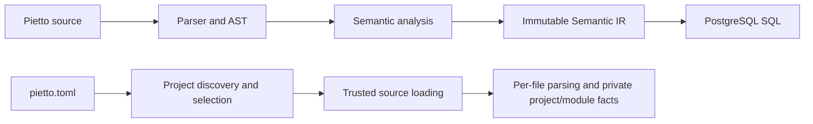

# Pietto

[](https://github.com/MianliWang/pietto/actions/workflows/ci.yml)


**Readable, typed SQL authoring with deterministic compilation.**

Pietto is a gradual, semantic SQL authoring DSL and compiler. It combines
Python-style indentation, readable declarations, compile-time validation, and
deterministic SQL generation so that a data model can grow without turning its
SQL boundary into an untyped string-building layer.

Pietto currently compiles explicitly selected PostgreSQL or MySQL SQL. It does
not connect to a database or execute the generated statements. PostgreSQL is
the public Python SQL backend; MySQL lowering is available through explicit CLI
selection while its emitter remains a private implementation surface.

The project is under active development. Package and CLI version `0.1.0`
describe the current repository package, not a published stability promise.
Start with the [Quick Start](#quick-start), then use the status and roadmap
sections to distinguish available behavior from active foundations.

## Why Pietto

SQL is an excellent execution language, but large SQL-authoring surfaces often
lose useful structure before a database ever sees them. Pietto keeps that
structure explicit during compilation.

- Describe shapes, sources, tables, and queries with compact declarations.
- Catch unknown names, incompatible types, invalid aggregates, and unsupported
  lowering before SQL execution.
- Preserve deterministic ordering, diagnostics, metadata, provenance, and
  lineage facts.
- Generate reviewable SQL for a deliberately bounded language surface.
- Grow from one source file toward project, module, and semantic-package
  workflows without introducing runtime evaluation.

The language is intentionally gradual. A small file can begin with a shape and
a query, while richer semantic facts remain available to the compiler as the
project grows. Unsupported behavior fails closed instead of silently emitting
an approximate query.

## Current Status

Pietto is a working compiler with an active project/module foundation. The
current repository facts are recorded in the [package metadata](pyproject.toml)
and the [Phase 54 plan](docs/plan/phase-54-local-import-module-export-foundation.md).

| Area | Current state |
| --- | --- |
| Package and CLI | `0.1.0` |
| Python | Requires `>=3.12`; CI checks 3.12 and 3.13 |
| PostgreSQL | Available SQL generation and public Python emitter |
| MySQL | Explicit CLI lowering; private emitter/API surface |
| Single-file mode | Check, explain, and emit SQL |
| Project schema v1 | Available legacy-flat project checking |
| Project schema v2 | Explicit-module identity and trusted-loading foundation |
| Runtime | Compiler only; no database connection or SQL execution |

Phase 54 is **ACTIVE**. Slices 1 through 3 are **COMPLETED**, Slices 4
through 16 are **UNSTARTED**, and the next lifecycle state is
`PHASE54_SLICE4_GATE0_GATE1`.

Slice 3 provides stable project-relative module identity, an immutable
selected-input index, pinned-root path checks, and trusted source loading.
Import/export source syntax remains owned by Slice 4. Binding environments,
module graphs, cross-module semantic resolution, inspection, serialization,
and end-to-end hardening remain later work within Phase 54.

## Quick Start

These instructions use the repository checkout and its locked uv environment.
Pietto does not currently claim an authorized public PyPI installation route.

### Install

From the repository root, install the locked development environment and
inspect the CLI:

```bash
uv sync --locked
uv run pietto --help
uv run pietto --version
```

### Check a Pietto file

Save the following program as
`demo-project/models/active_users.pietto`:

```pietto
pietto 0.9
mode checked
dialect postgres
encoding utf8

shape User:
    id: UUID not null
    email: Text nullable
    email_norm: Text nullable
    deleted_at: Timestamp nullable

source users: User is postgres.table("public.users")

table active_users:
    from users
    where deleted_at is null
    select:
        id
        email
        email_norm = lower(trim(email))
```

Check it in text mode or request the versioned JSON result:

```bash
uv run pietto check demo-project/models/active_users.pietto
uv run pietto check demo-project/models/active_users.pietto --format json
```

`check` parses the file and performs semantic validation. It does not generate
or execute SQL. Diagnostics are deterministic and carry stable codes and source
locations where the current stage can provide them.

### Generate SQL

Select PostgreSQL explicitly when lowering the same file:

```bash
uv run pietto emit-sql demo-project/models/active_users.pietto --dialect postgres
```

The generated SQL is:

```sql
SELECT
    "id" AS "id",
    "email" AS "email",
    lower(trim("email")) AS "email_norm"
FROM "public.users"
WHERE "deleted_at" IS NULL
```

SQL is written to stdout by default. The CLI can also return a versioned JSON
document or atomically replace an explicitly selected regular output file.
Generation stops on parser, semantic, IR, or backend errors.

### Work with a project

Use this minimal project layout:

```text
demo-project/
├── pietto.toml
└── models/
    └── active_users.pietto
```

For the currently available legacy-flat project semantics, create
`demo-project/pietto.toml` with schema version 1:

```toml
schema_version = 1

[sources]
include = ["models/*.pietto"]
```

Then check every selected source as one project compilation unit:

```bash
uv run pietto check --project demo-project
```

Project checking discovers the explicit root, validates the configuration,
selects inputs deterministically, parses each selected file, and builds the
current project semantic facts. Project mode does not emit project SQL.

## Language Tour

A Pietto file begins with a language version and may declare checking mode,
dialect, and encoding. Blocks use a colon followed by spaces-only indentation;
braces are not block delimiters.

The Quick Start program demonstrates the central vocabulary:

- `shape User` declares a typed row shape. `not null` and `nullable` are
  semantic nullability facts.
- `source users` binds that shape to an opaque PostgreSQL table name. The
  compiler preserves the physical name but never opens a connection.
- `table active_users` describes a relation over that source.
- `where deleted_at is null` is checked as a predicate and lowers to SQL null
  syntax.
- `email_norm = lower(trim(email))` creates a named computed output with row
  schema, dependency, origin, and lineage facts.

The implemented expression surface includes typed unary and binary operators,
comparisons, `between`, selected scalar transforms, and bounded numeric rules.
Aggregate queries support count-family operations, sum/average, min/max,
grouping, result predicates, grouped result ordering, and bounded window
families. Unsupported operand combinations and unsupported SQL shapes fail
closed with diagnostics.

Pietto source remains more constrained than arbitrary SQL. That constraint is
deliberate: accepted forms must have defined semantic behavior and
deterministic lowering for the selected backend.

## What Works Today

The labels in this table distinguish public behavior from private compiler
facts and forward-compatible foundations.

| Surface | Status | Current boundary |
| --- | --- | --- |
| Parser and immutable AST | Available | Indentation-based source and structured diagnostics |
| Semantic type checking and diagnostics | Available | Known types, nullability, names, expressions, and relations |
| Relations, computed fields, `let`, aggregates, grouping, and bounded windows | Available | Bounded, explicitly tested SQL-authoring surface |
| Single-file `check`, `explain`, and `emit-sql` | Available | Text and applicable JSON output |
| Schema-v1 legacy-flat project checking | Available | Deterministic selected-file project semantics |
| PostgreSQL generation and public Python emitter | Available | Handwritten deterministic SQL lowering |
| MySQL CLI lowering/private emitter | Private | Explicit CLI dialect; no public emitter export |
| CLI JSON v1, project JSON v2 envelope, and metadata artifact v1 | Available | Separately versioned output contracts |
| Project provenance, lineage, capability, and module carriers | Private | Compiler facts, not public API promises |
| Schema-v2 module identity, selected-input index, and trusted loader | Foundation | Active Phase 54 module-loading boundary |
| Import/export syntax and cross-module semantic resolution | Planned | Slice 4 and later Phase 54 work |

Existing project facts include deterministic source ordering, flat namespace
resolution for schema v1, row-schema propagation, relation dependency graphs,
aggregate and window facts, origin, dependency, provenance, lineage, and
capability readiness. Private facts may evolve until an independently
versioned public artifact adopts them.

## Project And Module Modes

Project mode always uses an explicit root containing `pietto.toml`. Source
patterns are configuration data, not executable Python, and selected files are
ordered and bounded before compilation.

### Schema version 1: legacy-flat projects

Schema version 1 is the available production project mode. All selected files
participate in one legacy-flat catalog. Project checking can resolve the
current type, source, table, query, relation, row-schema, aggregate, window,
origin, dependency, provenance, and lineage facts across that selected set.

Use schema version 1 for the Quick Start workflow. Duplicate declarations,
unknown references, relation cycles, invalid types, and unsupported expression
shapes report deterministic diagnostics. This mode remains compatible while
Phase 54 builds the explicit-module path.

### Schema version 2: explicit-module foundation

Schema version 2 activates the explicit-module compilation mode:

```toml
schema_version = 2

[sources]
include = ["models/*.pietto"]
```

The explicit-module identity and trusted-loading foundation exists, but
import/export syntax and module semantic resolution are still under active
Phase 54 development.

After Slice 3, each selected path has a stable logical module identity and an
immutable index entry. Project roots and source targets are pinned and checked
across discovery and reading; trusted snapshots preserve the exact bytes given
to the parser. These carriers remain private and are not serialized into the
current public project JSON envelope.

Schema-v2 semantic completion intentionally fails closed until module binding
and cross-module resolution exist. It is not yet a drop-in import system, and
multiple files cannot import symbols through production module syntax.

The activation carrier is specified in the
[schema-v2 carrier contract](docs/spec/phase54-slice2-schema-v2-explicit-module-activation-and-immutable-carrier-v1.md).
The loader and identity boundary is specified in the
[Slice 3 trusted-loader contract](docs/spec/phase54-slice3-module-identity-selected-input-index-trusted-local-loader-path-symlink-boundary-v1.md).

## Compiler Architecture

Pietto keeps compilation stages explicit. Public single-file SQL generation
and private project/module work share parsing primitives without pretending
that project SQL already exists.



The main SQL path above shows the current public PostgreSQL posture. Explicit
MySQL CLI lowering consumes the same immutable Semantic IR, but its emitter is
not exported as a public Python backend. Backend selection never executes a
connector.

The project path discovers and safely loads selected files. Schema v1 can
continue into the current flat project semantic model. Schema v2 currently
ends at per-file parsing and private identity/loading facts; it does not yet
produce module semantic resolution, Project IR, or project SQL.

## Roadmap

The roadmap is organized by product boundary rather than dates or completion
percentages. The complete route is maintained in the
[active Phase 53–70 roadmap](docs/spec/pietto-active-roadmap-phase53-70-v2.md).

| Route | Product milestone | Status or boundary |
| --- | --- | --- |
| Phase 54 | Local module, import, export, binding, graph, and hardening foundation | Active after Slice 3 |
| Phases 55–59 | Package assets, capability profiles, extension catalog, public inspection, and local package graph | Planned |
| Phase 60 | Advanced windows and ecosystem/release-readiness checkpoint | Planned; no tag or publication |
| Phases 61–63 | Project IR, relationships, JOIN semantics, multi-relation SQL, and `QUALIFY` | Planned |
| Phases 64–66 | Advanced types, aggregation, and advanced module/package assets | Planned |
| Phases 67–70 | Remote packages, solver/lockfile, Rust, dialect expansion, and ecosystem readiness | Planned |

Phase 68 is the preferred first production Rust kernel. Earlier phases may
shape pure, immutable, differential-testable boundaries, but they do not imply
a native rewrite.

Phase 60 does not tag or publish. Release 0.1.0 is separately authorized and
uses its own release workflow. Phase 70 targets v0.2 ecosystem-beta readiness,
not automatic publication or v1.0.

Roadmap phases identify ownership, not automatic implementation authority,
dates, or release promises. Each active slice retains its own scope,
validation, publication, and compatibility gates.

## Development

Run contributor commands from the repository root. The authoritative
validation entrypoint checks the lockfile, formatting, lint, production and
test typing, and the full test suite. Independent checks protect generated
ANTLR files, reviewed SQL/JSON goldens, and installed package behavior.

```bash
uv run python scripts/validate.py
uv run pytest tests/test_cli_golden_outputs.py
uv run python scripts/check_generated.py
uv run python scripts/check_goldens.py
uv run python scripts/package_smoke.py
```

The focused pytest command is useful while changing CLI golden presentation;
the authoritative validation command remains the local completion gate. The
three independent audit scripts are also run by CI and do not rewrite their
protected inputs.

For the rationale and exact validation boundaries, see the
[release-readiness and reproducible-validation plan](docs/plan/phase-11-release-readiness-reproducible-validation.md).

## Documentation

The README is a landing page, not a second lifecycle ledger. These documents
own detailed contracts:

- [Language specification](docs/spec/pietto-v0.9.md) — accepted language and
  compiler semantics.
- [Project configuration schema contract](docs/spec/phase44-project-config-schema-contract-v1.md) — current strict project configuration.
- [CLI JSON schema v1](docs/spec/cli-json-v1.md) — single-file machine-readable
  output.
- [Golden fixture policy](docs/spec/golden-fixture-policy-v1.md) — reviewed SQL
  and structural JSON fixture rules.
- [Diagnostics specification](docs/spec/diagnostics.md) — stable diagnostic
  families and messages.

Detailed historical plans remain in `docs/plan/`, while current and durable
contracts live in `docs/spec/`. The active roadmap and the current Phase 54
plan remain authoritative when a historical checkpoint describes an older
state.

## Project Boundaries

Pietto is a compiler and authoring language. Its boundaries are deliberate:

- It generates SQL but never executes it.
- It does not connect to a database, inspect schemas, or manage transactions.
- It is not an ORM, database optimizer replacement, arbitrary-SQL replacement,
  job scheduler, distributed runtime, or PostgreSQL extension manager.
- It provides no web UI, server runtime, deployment service, or policy engine.
- Compiler checks do not create access-control, privacy, authorization,
  row-level-security, masking, or safe-sharing guarantees.
- Private emitters and project facts are not public API commitments.
- Foundation and planned labels do not imply production module, package, JOIN,
  registry, remote-I/O, or Rust behavior.
- Package version `0.1.0` does not imply a tag, registry publication, signature,
  attestation, or release promise.

Database execution, locking, transactions, query planning, and physical
concurrency remain responsibilities of the selected database backend and the
application that submits generated SQL.

## License

This repository does not currently include a license file. Licensing is not
implied by the package version or roadmap.
